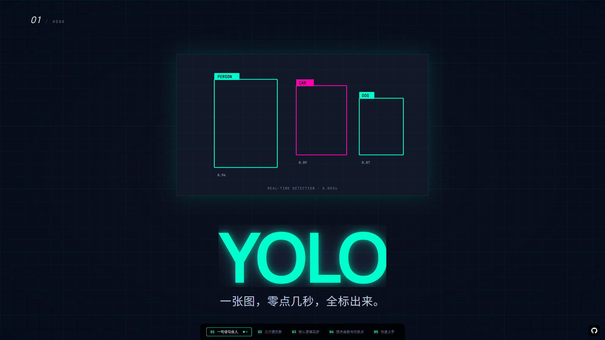

# Useful Skills

**MIPyao's open-source Agent Skills collection for Claude Code, Cursor, Codex, and all AI coding agents that support the `SKILL.md` format.**

[](https://skills.sh/MIPyao/useful-skills) [](#skills-gallery) [](LICENSE) [](#contributing)

[English](./README.md) · [中文文档](./README.zh-CN.md)

---

## Table of Contents

- [Installation](#installation)
- [What is a Skill?](#what-is-a-skill)
- [Contributing](#contributing)
- [License](#license)

---

## Skills

### [`vidwise`](./skills/vidwise)

**Category:** Web Video / Presentation Engineering  
**Use case:** Turn scripts, articles, lessons, product demos, and talks into videos (simulated as web pages).



`vidwise` builds screen-recordable Vite + React + TypeScript presentations. It converts raw articles into narration scripts, maps narration beats to full-screen visual steps, pauses at key checkpoints for user confirmation, and optionally synthesizes narration audio after visual outline approval.

Highlights:

- Fixed 1920×1080 stage, scaled to viewport for stable screen recording
- Click/keyboard-driven `(chapter, step)` cursor — one narration beat = one visual step
- Hard checkpoints after script, theme, outline, development mode, and optional audio synthesis
- Hover-only progress controls for clean recording output
- Theme-token visual architecture with **23 built-in themes**, each with unique design DNA
- **Pluggable TTS**: provider-agnostic audio runner with 3 built-in providers (MiniMax, OpenAI, edge-tts)
- **Optional SRT subtitle generation** from mp3 durations (requires ffprobe/ffmpeg)
- Scaffold produces Vite + React + TypeScript project with stage primitives and recording guide

Links: [README](./skills/vidwise/README.md) · [SKILL.md](./skills/vidwise/SKILL.md)

---

## Installation

### Method A · `skills` CLI (npx)

The fastest, cross-Agent method. Uses the community-standard [`npx skills` CLI](https://www.npmjs.com/package/skills).

```bash
# Install entire repo (all Skills), latest
npx skills add MIPyao/useful-skills

# Install only vidwise
npx skills add MIPyao/useful-skills -s vidwise

# Install globally (~/.skills) instead of current project (./.skills)
npx skills add MIPyao/useful-skills -s vidwise --global
```

Common subcommands:

```bash
npx skills list          # List installed skills
npx skills find vidwise  # Search within repo
npx skills update        # Update all
npx skills remove vidwise  # Uninstall
```

### Method B · Claude Code Plugin Marketplace

If you use [Claude Code](https://docs.anthropic.com/en/docs/claude-code), subscribe to the plugin marketplace:

```bash
/plugin marketplace add MIPyao/useful-skills
/plugin install vidwise-skills@useful-skills
```

Plugin packages defined in [`.claude-plugin/marketplace.json`](./.claude-plugin/marketplace.json):

| Plugin Package | Contains Skills |
|----------------|-----------------|
| `vidwise-skills` | `vidwise` |

### Method C · Releases pinned `.zip`

Download pinned `.zip` from [GitHub Releases](https://github.com/MIPyao/useful-skills/releases):

```bash
# Download and unzip to your project's skills directory
curl -fsSL -o vidwise.zip \
  "https://github.com/MIPyao/useful-skills/releases/latest/download/vidwise-latest.zip"
unzip -q vidwise.zip -d .claude/skills/
```

### Method D · Manual Copy to Project

```bash
git clone https://github.com/MIPyao/useful-skills.git
cp -r useful-skills/skills/vidwise your-project/.claude/skills/
```

---

## What is a Skill?

A **Skill** is a self-contained folder that an Agent can load on demand. Its core is a `SKILL.md` (YAML frontmatter + instructions), optionally paired with reference docs, scripts, and assets:

```
<skill-name>/
├── SKILL.md      ← Required: when to use + how to use
├── README.md     ← Human-readable documentation
├── references/   ← Optional: extension docs loaded on demand
├── scripts/      ← Optional: deterministic executable code
└── assets/       ← Optional: templates, fonts, icons, etc.
```

The Agent decides whether to activate the Skill based on the `description` in the frontmatter.

---

## Contributing

Issues, new Skills, and improvements to the release toolchain are welcome.

---

## License

MIT